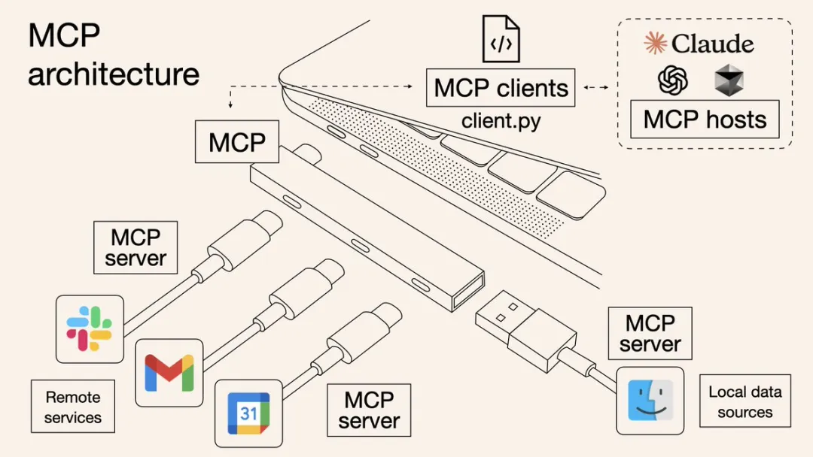
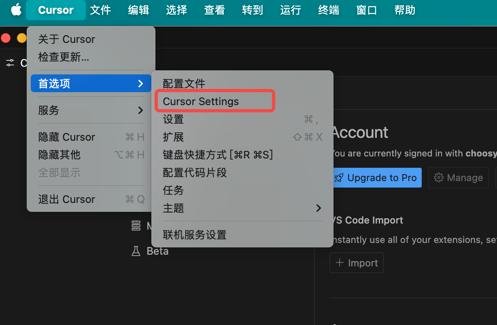

# 集成MCP（Model Context Protocol）
Anthropic 于 2024 年底推出了模型上下文协议（MCP）。作为一项新兴的开放协议，MCP 为 LLM 与外部应用之间构建了双向通信通道，就像是 AI 的“USB-C”接口，帮助模型发现、理解并安全调用各种外部工具或 API。这意味着：
- 开发者不再需要为对接每一个外部服务而编写复杂的定制接口。
- 用户可以体验到 AI 轻松调用海量第三方应用的能力，无论是处理日常办公任务、分析数据，还是执行营销自动化，AI 正从“智能对话”迈向“高效行动”。

  
(图片源自：[What is Model Context Protocol (MCP)? How it simplifies AI integrations compared to APIs | AI Agents](https://norahsakal.com/blog/mcp-vs-api-model-context-protocol-explained/))

APIPark 提供系统级别 MCP 服务和服务级别 MCP 服务，支持 AI Agent、MCP Host、MCP Client 等工具，以及 Claude、Cursor、Cline、Dify 等平台的无缝调用。MCP（Model Context Protocol，模型上下文协议） 是一种标准化协议，旨在实现 AI 模型、服务与客户端之间的高效通信与数据交互。
通过 APIPark 的 MCP Server，任何支持 MCP 协议的客户端均可快速接入其生态系统，实现互操作性、可扩展性和简化的工作流程。这使得开发者和企业能够利用 APIPark 强大的基础设施，以最小的集成成本构建、管理和部署 AI 驱动的解决方案。

## 系统级MCP Service
系统级别MCP（多云平台）接口提供了一个统一的、标准化的访问机制，用于访问平台上所有公开可用的服务。该功能旨在简化服务集成，实现在多样化服务之间的无缝交互，非常适合构建多模态智能体和自动化工作流程。

  

系统级别MCP提供以下Tool：
- service_list：此工具用于获取 APIPark 中已注册服务的列表。每个服务包含其唯一标识（service ID）、名称、描述及包含的 API 列表等关键信息。支持通过关键词进行模糊搜索，以便快速缩小查找范围。在获得某个服务的 ID 后，可以调用 openapi_document 工具来获取该服务的 OpenAPI 文档，以便后续调用其提供的 API 接口。
- openapi_document：此工具用于获取指定服务的 OpenAPI 接口文档。返回内容支持 OpenAPI v2 与 v3 两种规范格式。通过传入服务 ID，可以查看该服务的所有 API 定义、参数结构、请求方式等详细信息，为后续构造请求做准备。
- invoke_api：此工具用于直接调用指定的 API 接口。调用前需根据该接口的 OpenAPI 文档构造必要的请求参数，如请求路径、方法、查询参数、请求头、请求体等。调用过程中无需传递认证信息，例如请求头中的 Authorization 字段不需要提供。
以 获取当天天气信息 作为场景使用示例，AI Agent调用流程如下：
  

## 消费者级 MCP Service
消费者级 MCP Service 的能力和系统级 MCP Service 一致，区别在于可调用的 API 服务能力范围。 消费者级在通过MCP查询和请求接口的时候，只能调用该消费者已订阅服务的接口。
该功能提供更加安全和权限收敛的 MCP 调用模式，便于各团队可根据消费者权限情况，通过统一的 MCP Service 调用拥有权限的 API 能力。
  


## 服务级MCP Service
服务级别 MCP（Model Context Protocol）为 APIPark 提供了一种高效、标准化的方式，用于将服务与 AI Agent 及其他支持 MCP 协议的工具无缝集成。以下为主要功能：
- 一键开启 MCP 接入
支持快速将 HTTP 或 AI API 转换为 MCP 服务，用户只需简单配置即可完成接入，无需复杂开发，极大降低集成门槛。
- 服务广场 MCP 标签展示
已启用 MCP 的服务将在服务广场中显示专属的 MCP 标签，便于用户快速识别支持 MCP 协议的服务。
- 服务详情页 MCP 接入信息
在服务详情页面，用户可查看完整的 MCP 接入信息。只需复制相关配置信息，即可轻松集成到 AI Agent 或其他支持 MCP 的工具中，实现快速部署与应用。
通过以上功能，服务级别 MCP 助力开发者与企业高效构建和管理 AI 驱动的服务生态，提升系统的互操作性与扩展性。
### 新服务开启MCP
在服务列表页面，创建服务时开启MCP，如下图：

  

### 现存服务开启MCP
在服务设置界面，开启MCP，如下图：

  

### API门户展示MCP服务
待服务发布后，可在API门户查看服务的MCP信息，其中包括AI Client接入的MCP配置预览。

  

# 快速接入MCP Server
MCP Config可从上述教程系统级MCP或服务级MCP概况页面获取。已知MCP Config配置如下（仅做示例参考）：
```
{
  "mcpServers": {
    "APIPark-MCP-Server": {
      "url": "https://demo.apipark.com/openapi/v1/mcp/global/sse?apikey=6befa24c-3bd8-4a91-abf3-a733517a283e"
    }
  }
}
```
## Cursor接入MCP Server 
### Mac环境
1. 打开Cursor -> 首选项 -> Cursor Setting

  

2. 点击MCP -> Add new global MCP server

  

3. 将上文中的示例配置粘贴进去，保存即可。

  

4. 保存成功后，退回上一界面即可看到新增加的MCP Server。

  

## Trae接入MCP Server
Trae需要与Cline配合使用，因此在接入前，需要先在Trae上安装Cline。
1. 打开Trae的插件市场，安装Cline。

  

2. 左边导航栏选中Cline，点击MCP Servers -> Remote Server。将MCP Server信息复制进去，如下图：

  

3. 填写完成后，点击Add Server，加入成功后将会跳转到Installed页面，如下

  

