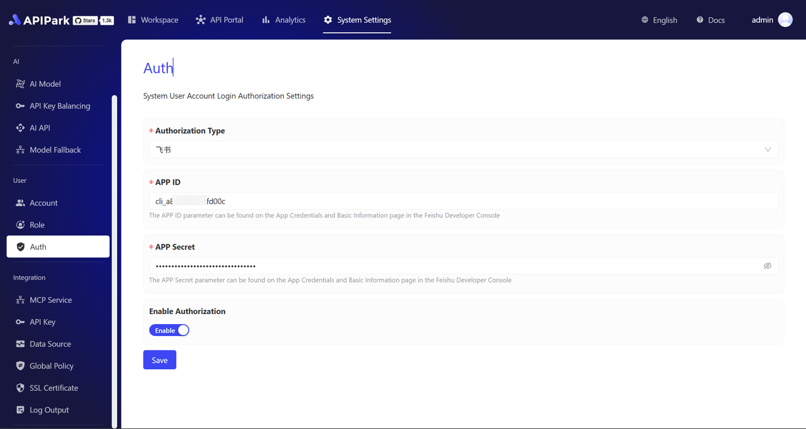
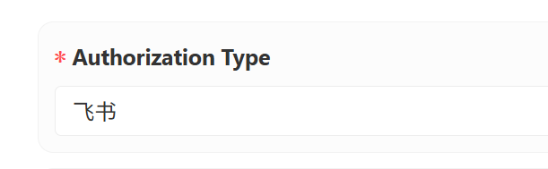
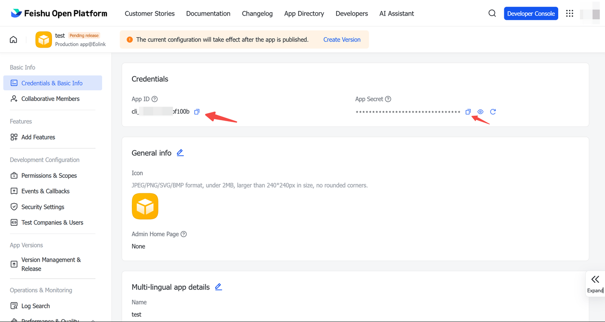
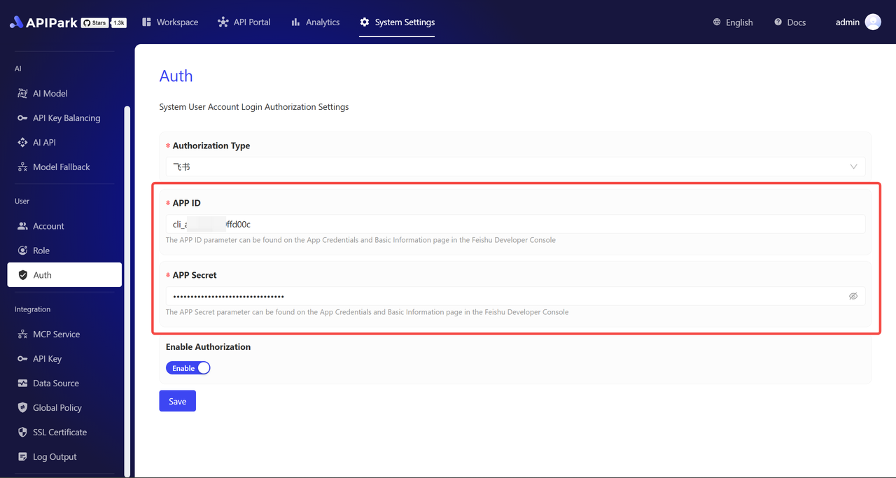
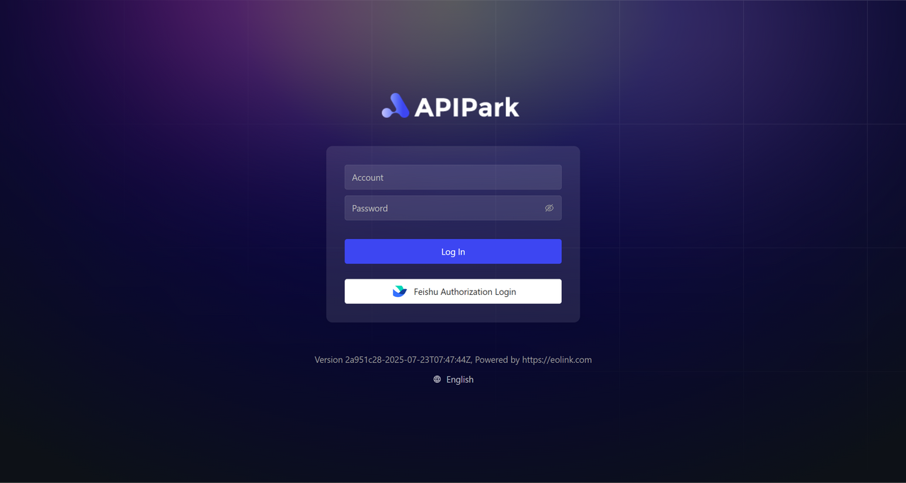

# 飞书授权登录
在系统设置中，选择用户鉴权菜单，可进入到账号授权登录设置页。可在此页面启用飞书账号作为第三方账号授权。
  
## 授权配置
1. 选择鉴权类型为“飞书”
在授权类型中，选择飞书。
  

2. 获取 APP ID 和 APP Sercret，并填入
- 登录飞书的开发人员控制台中的“应用程序凭证和基础信息”页面
  

- 把 APP ID 和 APP Sercret 填入到 APIPark 的账户授权配置页对应的输入框中。
  

3. 打开授权开关
完成以上字段填入后，打开授权开关，并保存即可立即生效。
  

## 飞书登录
授权配置完成后，在登录界面上，即可看到飞书授权登录入口
  

点击【飞书授权登录】按钮，根据指引登录即可。